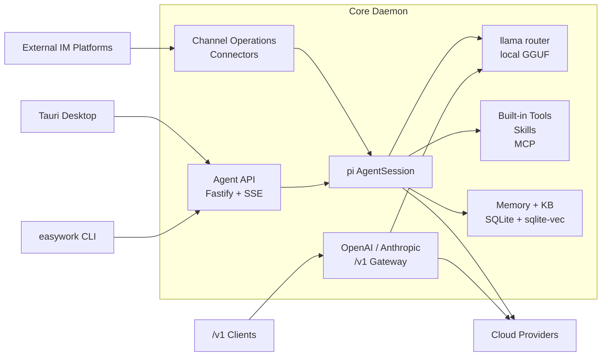

<div align="center">


# EasyWork

### 本地优先的 AI 工作台，把模型、记忆、工具、知识库和外部渠道收进同一个大脑。

[](https://github.com/LunarCache/easywork/actions/workflows/ci.yml)
[](https://github.com/LunarCache/easywork/releases)
[](LICENSE)
[](package.json)
[](tsconfig.base.json)
[](apps/desktop/src-tauri/tauri.conf.json)

**本地 GGUF / 云端模型** · **pi Agent 内核** · **Skills / MCP / 内置工具** · **知识库 RAG** · **作用域化记忆** · **桌面 + CLI + `/v1` 网关** · **Telegram / Feishu / Lark / WeChat 渠道**

```bash
curl -LsSf https://raw.githubusercontent.com/LunarCache/easywork/main/install.sh | sh
```

</div>

---

## 为什么是 EasyWork

EasyWork 不是一个只包了聊天框的客户端。它的核心是一个本地守护进程：同一个 daemon 托管 agent 会话、模型路由、工具审批、记忆、知识库、外部渠道连接器和 OpenAI/Anthropic 兼容网关。桌面和命令行通过 HTTP/SSE 作为瘦客户端接入；渠道 adapter/host 运行在 core 进程内，直接把外部消息交给同一个 `SessionHost`。`/v1` 客户端则走兼容网关，仅复用 daemon 的模型/provider runtime，不进入 `AgentSession`，也不附带记忆和工具。

| 能力 | 说明 |
|---|---|
| **本地优先** | 本地 GGUF 通过统一 `llama serve --models-dir` router 运行，按需加载、多模型路由、LRU 淘汰；云端既可直接使用 pi-ai 内置 provider，也可接 OpenAI / Anthropic 等多协议兼容端点。 |
| **真正的 Agent** | 托管 [`pi-coding-agent`](https://github.com/earendil-works/pi) 的 `AgentSession`，自带 read/bash/edit/write/grep/ls/find、上下文压缩、会话管理。 |
| **可审计工具流** | 4 档审批策略、工作区路径硬隔离、行内工具调用、git 改动审阅、终端和文件预览都在同一个工作台内。 |
| **记得住，也查得到** | 作用域化记忆 + sqlite-vec 语义召回 + 词法兜底；知识库文档支持解析、分块、检索和引用。 |
| **多入口一个宿主** | Tauri 桌面、CLI 与 Telegram / Feishu / Lark / WeChat 渠道复用同一套 Agent 宿主能力，渠道生命周期由 core 侧 Channel Operations 统一管理。OpenAI `/v1` 与 Anthropic `/v1/messages` 只共享模型/provider runtime，不经过 AgentSession、记忆或工具。 |

---

## 架构一览



核心原则很简单：**daemon 拥有全部状态和能力，所有界面都是薄壳**。桌面聊天、工作区 agent、外部渠道消息和命令行自动化复用同一套 `SessionHost`、权限、记忆和模型配置；`/v1` 兼容网关只复用同一 daemon 内的模型与 provider runtime。

---

## 功能地图

### Agent 工作台

- 对话模式：适合问答、总结、联网搜索、知识库检索和多模态输入。
- 工作区模式：在本地项目目录内读写文件、运行命令、查看 git diff、预览文件和终端输出。
- 右侧工作台坞：改动、文件、终端、预览和上下文状态常驻可见。
- 行内工具调用：思考、探索、编辑、运行、web search 等过程结构化展示。

### 模型与网关

- 本地模型：HuggingFace 搜索、断点续传下载、GGUF 元数据解析、统一 llama router 运行，并可在模型页按模型配置默认运行采样参数。
- 云端 provider：内置 pi-ai 支持的 provider 目录；自定义端点可选择 OpenAI Chat/Responses、Anthropic Messages 等 API 协议，支持从 `/models` 获取模型列表，并逐模型配置上下文、模态与推理能力。
- 模型目录继承：自定义模型可按模型 ID 自动或手动绑定目录模板。运行时可跨 API 协议继承模板的名称、`reasoning`、`thinkingLevelMap` 和 `maxTokens`；上下文窗口与输入模态只在 UI 选定模板时复制并保存到模型配置，不会在运行时覆盖既有配置。报文级 `compat` 仅在模板 API 与当前 API 一致时应用；同名模型始终以 `provider:<providerId>:<modelId>` 隔离。
- 思考默认值：`/models.modelSources[].reasoning` 将运行时推理能力同步给 Chat / Workspace；推理模型首次使用默认「中」，显式选择「关」后按模型持久化。
- 多协议 API：OpenAI `/v1/chat/completions`、`/v1/embeddings`、`/v1/models`，以及 Anthropic `/v1/messages`。

### 记忆、知识库、Skills、MCP

- Core Memory 只保存 User Profile / Agent Notes；自动事实保留来源所有权，删除来源对话会级联删除未提升事实。工作区记忆隔离，支持语义/词法召回和 markdown 回灌；外部 Deep Memory 只能追加受限召回，不能替换本地真相源。记忆页把搜索和添加保持为主操作，向量 / 外部 Provider 收成紧凑运行状态；旧版 Skill 迁移审计在无歧义项时折叠为次级信息，有待判断项时自动展开并突出数量。
- 知识库支持上传、解析、分块、混合检索和引用来源。
- Skills 页面以“已启用 / 待审核 / 已归档”分开全局来源与 learned Skills；自动学习状态常驻摘要，阈值、模型、自动检查和智能合并提案按需展开，避免挤占主要管理流程。Chat 或设置里的“学习 Skill”和受限后台复盘都只生成 Candidate，明确批准后才会激活。候选支持完整 package 验证、工作区 scope、证据、乐观锁 patch；learned Skills 支持遥测、固定、快照、归档、恢复和回滚。
- MCP 支持 stdio 与 HTTP，工具清单探测、启停、导入和审批一体化。

### 外部渠道

- Channel Gateway 把不同平台统一成 adapter；core 侧 Channel Operations 统一管理连接器生命周期、扫码连接会话、收件箱读模型和 SSE 失效事件。
- Telegram long-poll、Feishu/Lark WebSocket 与 webhook、WeChat iLink QR + long-poll 已落地。
- 渠道 secret 不再写入 SQLite：macOS 使用 Keychain、Linux 使用 Secret Service、Windows 使用当前用户 DPAPI；旧版明文配置会在启动时自动迁移，管理 API 只返回已配置字段名而不回显密钥。
- 收件箱按外部联系人聚合消息，使用 SSE invalidation 实时刷新。

---

## 安装

### macOS Apple Silicon

```bash
curl -LsSf https://raw.githubusercontent.com/LunarCache/easywork/main/install.sh | sh
```

也可以从 [Releases](https://github.com/LunarCache/easywork/releases) 下载 dmg 装到 `/Applications`。

安装包内置单文件 daemon（Node SEA），运行无需系统 Node。首次启动会检测本地推理运行时；缺失时可在模型页点击安装，通过 [llama.app](https://llama.app) 获取统一 `llama`。上面的 `install.sh` 则会在安装应用后自动尝试补齐该运行时。

> 当前 macOS 包为 ad-hoc 未签名版本。若手动下载 dmg 遇到 Gatekeeper 提示，可在「系统设置 -> 隐私与安全性」选择仍要打开，或执行 `xattr -dr com.apple.quarantine /Applications/EasyWork.app`。

### 其他平台

Intel Mac、Windows、Linux 安装包仍在后续发布计划中。源码开发已按跨平台路径设计，Windows 需要额外安装 Git for Windows。

---

## CLI

当前 DMG 与 `install.sh` 只安装 `EasyWork.app`，**不会**在 `PATH` 中创建 `easywork` 命令；独立 CLI 安装入口尚待提供。CLI 既是 daemon 入口也是终端客户端，运行时会自动发现或拉起本机 daemon；当前可从源码树使用：

```bash
npm install
npm run build

npm exec --workspace @ew/daemon -- easywork                                      # 交互式 REPL
npm exec --workspace @ew/daemon -- easywork run "总结这个仓库"                    # 一次性问答
cat error.log | npm exec --workspace @ew/daemon -- easywork run                   # stdin 全部作为提问
npm exec --workspace @ew/daemon -- easywork run "重构 utils.ts" -w . -y          # 在当前目录运行 agent 并自动批准
npm exec --workspace @ew/daemon -- easywork run "继续" -t <threadId>             # 续接已有会话

npm exec --workspace @ew/daemon -- easywork models                              # 列出已路由和本地模型
npm exec --workspace @ew/daemon -- easywork models pull <hf-repo>               # 下载 GGUF
npm exec --workspace @ew/daemon -- easywork models rm <name>                    # 删除本地模型
npm exec --workspace @ew/daemon -- easywork thread ls / show <id> / rm <id>     # 会话历史
npm exec --workspace @ew/daemon -- easywork mem ls / search <query> / rm <id>   # 记忆
npm exec --workspace @ew/daemon -- easywork kb ls / search <query> / add <file> # 知识库
npm exec --workspace @ew/daemon -- easywork status / stop                       # daemon 状态 / 停止
```

常用选项：`-m/--model`、`-w/--workspace <dir>`、`-t/--thread <id>`、`-y/--yes`。

常用环境变量：`EW_BASEURL`、`EW_TOKEN`、`EW_MODEL`。

---

## 从源码开发

### 环境要求

| 依赖 | 说明 |
|---|---|
| Node.js | `>=24`，推荐 Node 26；依赖内置 `node:sqlite`。 |
| npm | 项目统一使用 npm，不使用 pnpm。 |
| Rust | 构建 Tauri 桌面壳需要 `cargo`。 |
| llama | 本地推理统一使用 llama.app 的 `llama`，router 模式必需。 |
| Git | Windows 平台建议安装 Git for Windows（同时提供 pi `bash` 工具需要的 Git Bash）。 |

安装 llama：

```bash
curl -LsSf https://llama.app/install.sh | sh
```

### 常用命令

```bash
npm install
npm run build
npm run lint
npm run typecheck
npm test               # vitest: 349 passed / 1 skipped
npm run test:coverage

npm run e2e:install
npm run test:e2e       # Playwright UI e2e: 29 条，真 daemon + 真 Vite + 隔离 data dir

npm run dev:daemon     # 仅启动 daemon，首行输出 {baseUrl, token, pid}
npm run dev:ui         # 仅启动 Vite
npm run dev:desktop    # Tauri dev: Rust 壳 + Vite + daemon sidecar
```

> Windows 提示：`@ew/desktop` 的 `dev` 脚本当前使用 `EW_DAEMON_ENTRY="$PWD/…"` 这类 POSIX 环境变量赋值语法，默认 PowerShell/cmd 下的 npm script shell 无法直接执行。需先为 npm 配置 POSIX `script-shell`，或将该脚本改为跨平台写法，再运行 `npm run dev:desktop`。

构建发布产物：

```bash
node scripts/build-daemon-sea.mjs
npm run app:build --workspace @ew/desktop
```

发布流程：推送 `v*` tag 触发 [`release.yml`](.github/workflows/release.yml)，先运行 `npm run release:check-version` 校验 npm / Tauri / Cargo 版本与 tag 一致，再由 macOS Apple Silicon runner 构建 dmg 并上传到 GitHub Releases。Desktop WebView 启用显式 CSP，保留 Tauri IPC、本地 daemon 与沙盒预览所需来源，同时禁止远程脚本、对象插件和表单提交。

---

## 测试覆盖

- Vitest：349 passed / 1 skipped。
- Playwright UI e2e：29 条，覆盖设置页、模型模板跨协议元数据继承、推理模型默认思考档位、默认工作区直达、渠道/知识库/Skills/记忆入口与设置层级、Chat / Workspace composer 无边框控件与上下文用量悬停详情、联网工具门控、图片上传与粘贴、搜索导航、文件页、macOS 工作台安全区、来源事实、记忆 CRUD、知识库、Skills 模板/候选 diff/审批与显式学习。
- 真机 runtime smoke：`EW_E2E=1 npx vitest run packages/core/test/session-host.e2e.test.ts`，依赖本地 `llama` 与真实 GGUF，默认不进 CI。

---

## 文档入口

| 文档 | 内容 |
|---|---|
| [docs/DESIGN.md](docs/DESIGN.md) | 系统设计与功能详解：架构、子系统原理、关键数据流和设计取舍。 |
| [docs/FEATURES.md](docs/FEATURES.md) | 功能说明：模型、Agent、记忆、RAG、UI、`/v1` 端点。 |
| [docs/ARCHITECTURE.md](docs/ARCHITECTURE.md) | Core daemon、monorepo、技术栈、环境变量和平台说明。 |
| [docs/PROGRESS.md](docs/PROGRESS.md) | 状态总览与倒序里程碑日志。 |
| [AGENTS.md](AGENTS.md) | 开发约定、关键正确性约束和常用命令。 |

---

## 许可证

[MIT](LICENSE) © 2026 LunarCache
