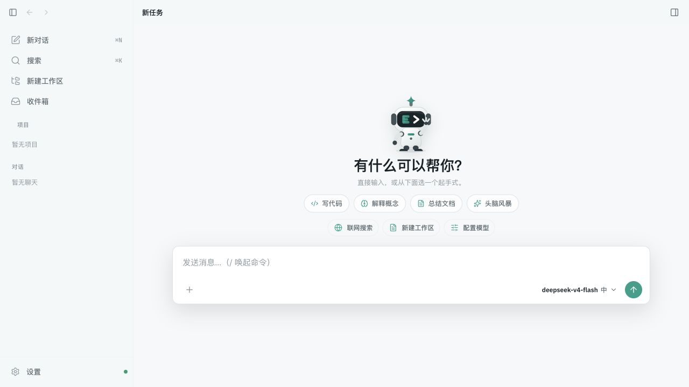
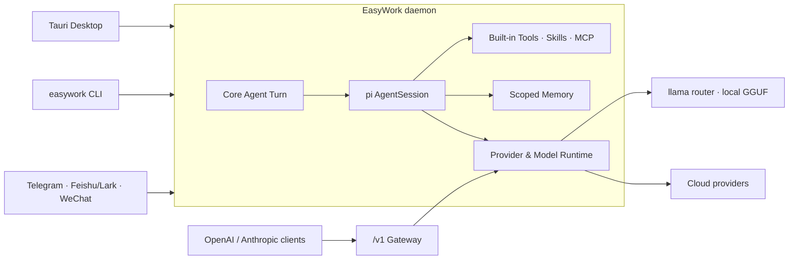

<div align="center">


# EasyWork

**本地优先、可扩展的桌面 AI 工作台**

在一个应用里连接本地与云端模型，并为 Agent 提供工作区、记忆、Skills、MCP、终端和外部消息渠道。

[](https://github.com/LunarCache/easywork/actions/workflows/ci.yml)
[](https://github.com/LunarCache/easywork/releases/latest)
[](LICENSE)
[](package.json)
[](tsconfig.base.json)
[](apps/desktop/src-tauri/tauri.conf.json)

[下载安装](#安装) · [快速开始](#快速开始) · [功能概览](#功能概览) · [开发指南](#从源码开发) · [项目文档](#项目文档)

</div>



## EasyWork 是什么

EasyWork 不是单纯的模型聊天客户端。它以本地 daemon 为核心，统一管理 Agent 会话、模型路由、工具审批、长期记忆、外部渠道与 OpenAI/Anthropic 兼容 API；Tauri 桌面端和 CLI 都是它的轻量入口。

适合这些场景：

- 在本机运行 GGUF 模型，同时保留连接云端模型的能力。
- 让 Agent 在明确的审批策略下读取项目、修改文件、运行命令并审阅 git diff。
- 在对话之间复用作用域化记忆、Skills 和 MCP 工具。
- 从 Telegram、飞书/Lark 或微信接入同一个 Agent 宿主。
- 为现有工具提供 OpenAI 或 Anthropic 兼容的本地模型网关。

> 当前项目处于 Beta 阶段。核心功能和 macOS/Windows 构建链已可用，但安装包尚未签名，部分渠道仍需要真实平台凭证联调。

## 功能概览

| 能力           | 说明                                                                                                           |
| -------------- | -------------------------------------------------------------------------------------------------------------- |
| 本地与云端模型 | 本地 GGUF 使用 llama.app 的单进程 router 按需加载；云端支持 pi-ai 内置 Provider 与 OpenAI/Anthropic 兼容端点。 |
| Agent 工作区   | 托管 `pi-coding-agent` 的 `AgentSession`，支持文件读写、命令执行、上下文压缩、工具调用与会话恢复。             |
| 安全与审批     | 4 档审批策略、工作区路径约束、工具调用可视化；Desktop 用户终端与 Agent 命令相互独立。                          |
| 记忆与检索     | Core Memory 与 Workspace Memory 分层保存，支持 sqlite-vec 语义召回、词法降级与 FTS5 会话全文检索。             |
| Skills 与 MCP  | 支持全局/工作区 Skills、候选审核与版本回滚；MCP 支持 HTTP 和受控的 stdio 接入。                                |
| 多入口         | Tauri 桌面端、CLI、Telegram、飞书/Lark、微信共享同一套 Agent 宿主能力。                                        |
| API 网关       | 提供 OpenAI `/v1/chat/completions`、`/v1/embeddings`、`/v1/models` 与 Anthropic `/v1/messages`。               |

更多功能与边界说明见 [功能文档](docs/FEATURES.md)。

## 安装

### macOS Apple Silicon

```bash
curl -LsSf https://raw.githubusercontent.com/LunarCache/easywork/main/install.sh | sh
```

也可以从 [GitHub Releases](https://github.com/LunarCache/easywork/releases/latest) 下载 DMG 并拖入 `/Applications`。

当前 macOS 包使用 ad-hoc 签名。若 Gatekeeper 阻止启动，可在“系统设置 → 隐私与安全性”中选择仍要打开，或执行：

```bash
xattr -dr com.apple.quarantine /Applications/EasyWork.app
```

### Windows x64

```powershell
irm https://raw.githubusercontent.com/LunarCache/easywork/main/install.ps1 | iex
```

发布流程会生成 NSIS `.exe` 与 MSI 安装包。当前尚未配置 Authenticode 签名，系统可能显示未知发布者提示。

安装包内置单文件 daemon，无需额外安装 Node.js。首次使用本地模型时，EasyWork 会引导安装 [llama.app](https://llama.app) 运行时。

> Intel Mac、Windows ARM64 与 Linux 桌面安装包仍在规划中。

## 快速开始

1. 启动 EasyWork，进入“设置 → 模型”。
2. 下载本地 GGUF 模型，或添加云端 Provider 和 API Key。
3. 回到新任务页选择模型，直接开始对话。
4. 需要操作项目时创建工作区，并按风险选择审批策略。
5. 按需在设置中启用记忆、Skills、MCP 或外部渠道。

本地模型统一由 `llama serve --models-dir` router 管理，可按请求自动加载多个模型并通过 LRU 控制常驻数量；记忆嵌入模型使用独立进程，缺失时自动降级为词法召回。

## CLI

桌面安装包目前不会把 `easywork` 命令写入 `PATH`。从源码构建后可使用完整 CLI：

```bash
npm install
npm run build

# 交互式会话
npm exec --workspace @ew/daemon -- easywork

# 一次性任务
npm exec --workspace @ew/daemon -- easywork run "总结这个仓库"

# 在当前目录运行 Agent，并自动批准工具调用
npm exec --workspace @ew/daemon -- easywork run "检查并修复测试" -w . -y

# 管理模型、会话与记忆
npm exec --workspace @ew/daemon -- easywork models
npm exec --workspace @ew/daemon -- easywork thread ls
npm exec --workspace @ew/daemon -- easywork mem ls
```

常用选项包括 `--model`、`--workspace`、`--thread` 和 `--yes`；远程连接可使用 `EW_BASEURL`、`EW_TOKEN` 与 `EW_MODEL`。

## 架构



架构遵循三个原则：

- **daemon 拥有状态**：会话、记忆、模型和渠道生命周期都在核心进程中完成。
- **客户端保持轻量**：桌面 UI 与 CLI 通过 HTTP/SSE 使用同一套能力。
- **兼容网关保持隔离**：`/v1` 只复用模型运行时，不隐式携带 Agent 工具或记忆。

完整模块图、数据流和正确性约束见 [架构文档](docs/ARCHITECTURE.md) 与 [设计文档](docs/DESIGN.md)。

## 从源码开发

### 环境要求

- Node.js `>=24`
- npm（项目不使用 pnpm）
- Rust stable 与 Cargo（仅 Desktop 构建需要）
- Git；Windows 推荐安装 Git for Windows
- llama.app 的 `llama`（仅本地推理与真机 smoke 需要）

```bash
git clone https://github.com/LunarCache/easywork.git
cd easywork
npm install

# 开发服务
npm run dev:daemon
npm run dev:ui
npm run dev:desktop

# 质量检查
npm run lint
npm run typecheck
npm test
npm run test:e2e
npm run build
```

### Monorepo

```text
apps/
  daemon/          daemon 与 easywork CLI 入口
  desktop/         Tauri 2 桌面宿主
  ui/              React 19 + Vite 前端
packages/
  core/            Agent、server、模型及生命周期编排
  shared/          Zod 契约与共享类型
  providers/       本地与云端推理引擎
  memory/          作用域化记忆与混合召回
  tools/           内置工具与网络安全边界
  skills/          Skills 发现与执行
  mcp/             MCP 客户端
  im-connectors/   外部消息渠道 adapters
  sdk/             daemon 类型化 HTTP 客户端
```

改动 `@ew/core` 或 `@ew/sdk` 后，请先运行 `npm run build`，再验证依赖其 `dist` 的 daemon 与桌面端。

## 项目状态

已完成的主要能力包括 Core daemon、Agent 工作区、本地/云端模型、多协议网关、记忆、Skills/MCP、CLI、macOS/Windows 打包链以及 Telegram、飞书/Lark、微信连接器。

当前重点：

- Discord 与企业微信 adapters 及真实凭证联调。
- Provider/MCP 密钥迁移到系统安全存储。
- Python/Terminal 独立 OS 级沙箱。
- 安装包签名、公证、自动更新及更多平台架构。
- 可选的内嵌代码编辑器。

详细里程碑与最新测试状态见 [docs/PROGRESS.md](docs/PROGRESS.md)。

## 项目文档

| 文档                                    | 内容                             |
| --------------------------------------- | -------------------------------- |
| [FEATURES.md](docs/FEATURES.md)         | 功能、交互与产品边界             |
| [ARCHITECTURE.md](docs/ARCHITECTURE.md) | 系统架构、技术栈与环境变量       |
| [DESIGN.md](docs/DESIGN.md)             | 子系统原理、关键数据流与设计取舍 |
| [PROGRESS.md](docs/PROGRESS.md)         | 当前状态与倒序里程碑日志         |
| [AGENTS.md](AGENTS.md)                  | Agent 开发约定与正确性约束       |

## 贡献与反馈

- 功能建议和普通缺陷请提交 [GitHub Issue](https://github.com/LunarCache/easywork/issues/new)。提交前请先搜索是否已有相关问题，并附上操作系统、EasyWork 版本、复现步骤和必要日志。
- 代码改动建议先通过 Issue 对齐范围，再提交聚焦、可审阅的 Pull Request。
- 提交 PR 前请至少运行 `npm run lint`、`npm run typecheck` 和 `npm test`；涉及 UI 行为时还应运行 `npm run test:e2e`。
- 开发约束、架构入口和关键正确性规则见 [AGENTS.md](AGENTS.md)。

## 安全说明

- 工作区文件工具会解析真实路径并阻止越界访问；shell 命令仍由审批策略把守。
- 渠道密钥保存在系统安全存储中；Provider/MCP 密钥迁移仍在计划内。
- stdio MCP 默认关闭，因为它可以执行本机命令。
- 本项目尚未提供独立 OS 级代码执行沙箱，请仅在可信工作区使用高权限审批模式。

如发现安全问题，请勿在公开 Issue 中披露密钥、个人数据、利用代码或完整漏洞细节。仓库目前尚未启用 GitHub 私密漏洞报告；请先提交一个不含敏感细节的 [安全联系请求](https://github.com/LunarCache/easywork/issues/new?title=%5BSecurity%5D%20Private%20contact%20request)，由维护者提供私密沟通方式。

## License

[MIT](LICENSE) © 2026 LunarCache
